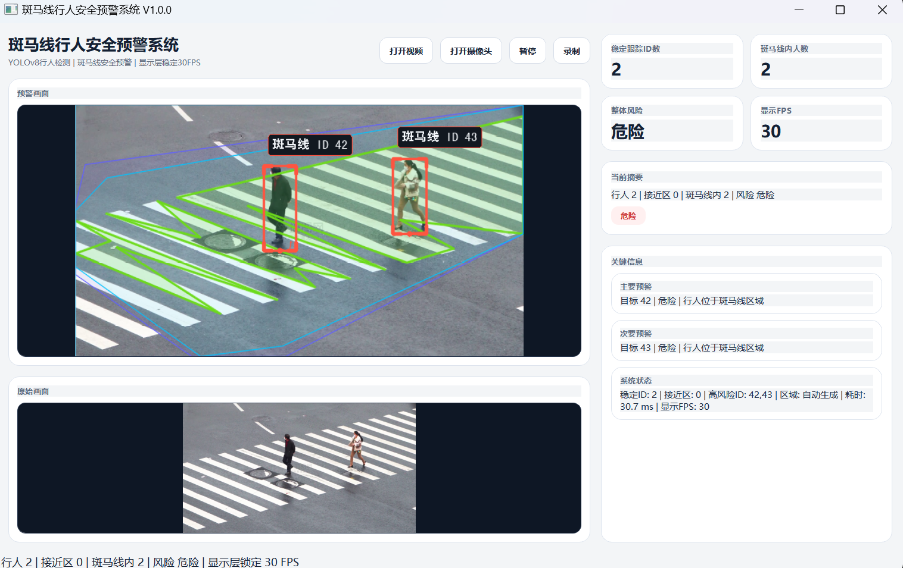

# ZebraWatch

基于 YOLOv8 和 PyQt5 的斑马线行人检测与安全预警系统。

ZebraWatch 面向交通安全、校园周边道路和斑马线过街场景，核心目标是实时识别行人、斑马线区域，并结合跟踪与风险分析模块，对“是否正在斑马线上、是否存在潜在危险行为”做出提示。

## 项目简介

ZebraWatch 是一个桌面端视觉分析项目，支持图片、视频和摄像头输入，能够在界面中实时显示检测结果、跟踪轨迹和风险状态。

当前项目已经包含以下主要能力：

- 行人检测
- 斑马线检测
- 多目标跟踪
- 轨迹预测
- 安全风险分析
- PyQt5 图形界面展示

## 项目截图



## 主要功能

- 支持图片、视频文件和摄像头实时检测
- 检测行人目标并进行目标跟踪
- 检测斑马线区域并进行可视化叠加
- 结合行人位置、运动方向、速度、驻留时间等信息进行风险判断
- 支持结果标注、状态提示和日志输出

## 技术栈

- Python
- PyQt5
- Ultralytics YOLOv8
- OpenCV
- NumPy
- Pillow
- LAP
- SQLite3

## 目录结构

```text
ZebraWatch/
├── run.py                     # 程序入口
├── README.md                  # 项目说明
├── requirements.txt           # Python 依赖
├── weights/                   # 训练/推理模型文件
├── icons/                     # 界面图标资源
├── images/                    # 图片资源和截图
├── docs/                      # 设计文档
├── src/
│   ├── gui/                   # PyQt5 界面层
│   ├── detect/                # 旧版/辅助检测模块
│   ├── zebra_crossing_detection/  # 斑马线检测模块
│   ├── pedestrian_tracking/   # 行人跟踪模块
│   ├── safety_analysis/       # 风险分析模块
│   ├── lstm_prediction/       # 轨迹预测模块
│   ├── model_inference/       # 模型推理封装
│   └── threads/               # 多线程读取与处理
└── SimHei.ttf                 # 中文字体
```

## 环境要求

- Windows 10/11 推荐
- Python 3.12.x 推荐
- 内存建议 4GB 以上
- 有独立显卡可获得更好的推理速度，但不是必须

## 安装依赖

建议使用独立虚拟环境。

```bash
python -m venv .venv
.venv\Scripts\activate
pip install -r requirements.txt
```

## 运行项目

```bash
python run.py
```

首次启动时，程序会加载本地模型文件和界面资源。

## 模型文件

项目依赖的模型文件已放在仓库中，常见文件包括：

- `weights/zebra.pt`
- `yolov8n.pt`
- `yolov8m.pt`

如果你后续更新模型，建议继续放在 `weights/` 目录下，方便统一管理。

## 已实现的核心模块

- `src/zebra_crossing_detection/`
  - 斑马线区域检测
  - 支持基于 YOLO 和传统视觉方法的组合检测

- `src/pedestrian_tracking/`
  - 行人目标跟踪
  - IOU 匹配与历史轨迹维护

- `src/safety_analysis/`
  - 场景区域分析
  - 风险评分与告警判断

- `src/lstm_prediction/`
  - 轨迹预测相关接口
  - 预留后续时序建模能力

- `src/gui/`
  - PyQt5 图形界面
  - 输入源选择、结果展示、状态栏和交互逻辑

## 后续计划

下一阶段我计划继续尝试加入红绿灯逻辑判读，把斑马线检测、行人状态、信号灯状态和路口通行规则串联起来，逐步形成一个更完整的城市交通安全闭环。

后续方向包括：

- 红绿灯状态识别
- 路口通行规则判读
- 行人过街意图分析
- 与斑马线检测联动的安全预警
- 形成“检测-判断-提示-闭环”的城市绿波/交通安全分析流程

## 常见问题

### 1. 提示 `no Qt platform plugin could be initialized`

这是 Windows 下比较常见的 Qt 环境问题，通常和安装路径或旧虚拟环境有关。

建议：

- 把项目放到纯英文路径下
- 删除旧虚拟环境后重新创建
- 重新执行 `pip install -r requirements.txt`

### 2. 模型加载失败

确认以下文件存在：

- `weights/zebra.pt`
- `yolov8n.pt`

自训练模型本人不提供

### 3. 摄像头无法打开

请检查：

- 摄像头是否被其他程序占用
- 系统隐私权限是否允许 Python 访问摄像头
- 输入源编号是否正确

## 开发说明

这个项目更适合“边完善边提交”的方式维护。后续如果你要继续放到 GitHub，建议继续补充：

- 项目演示视频
- 模型训练说明
- 数据集来源说明
- 许可证文件

## 致谢

- Ultralytics YOLOv8
- PyQt5
- OpenCV
- NumPy

## 联系方式

如有问题或建议，请通过以下方式联系：

- Email: xiangrui0070@gmail.com
- 微信: Liang-Zai_666

